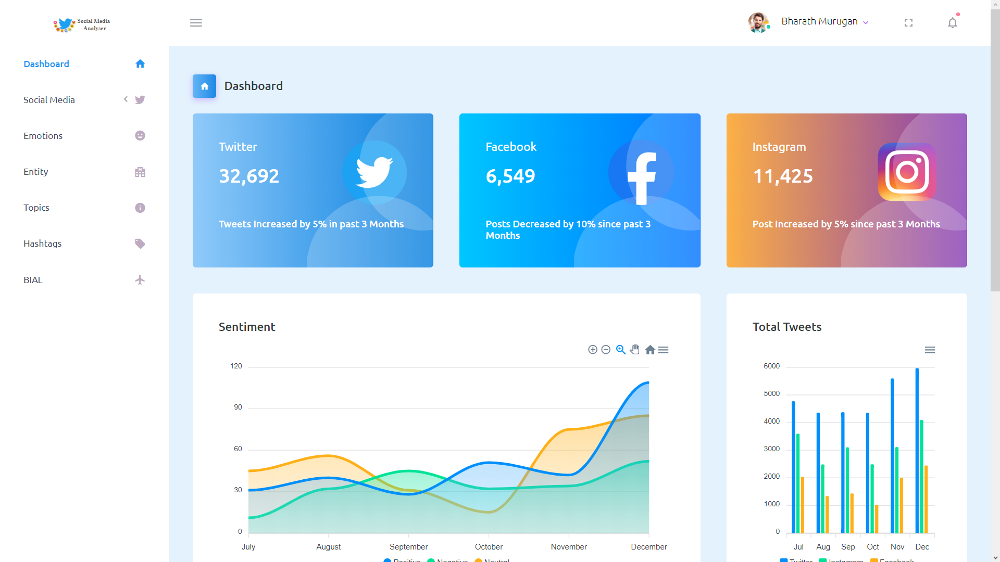
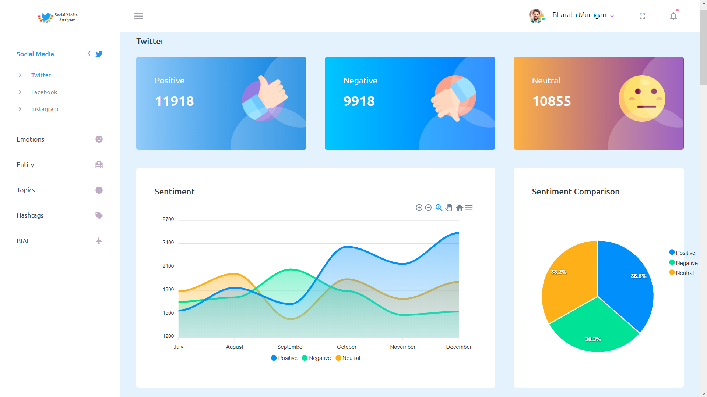
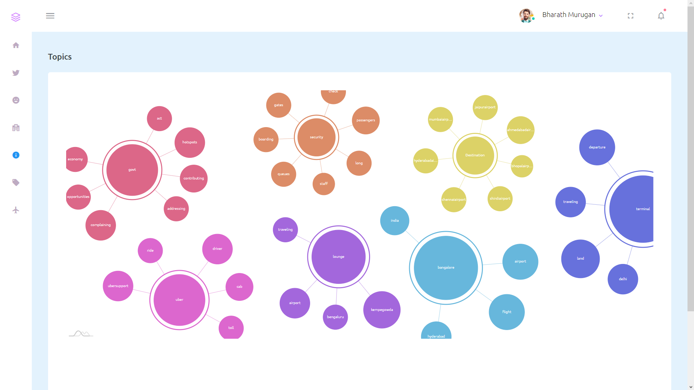
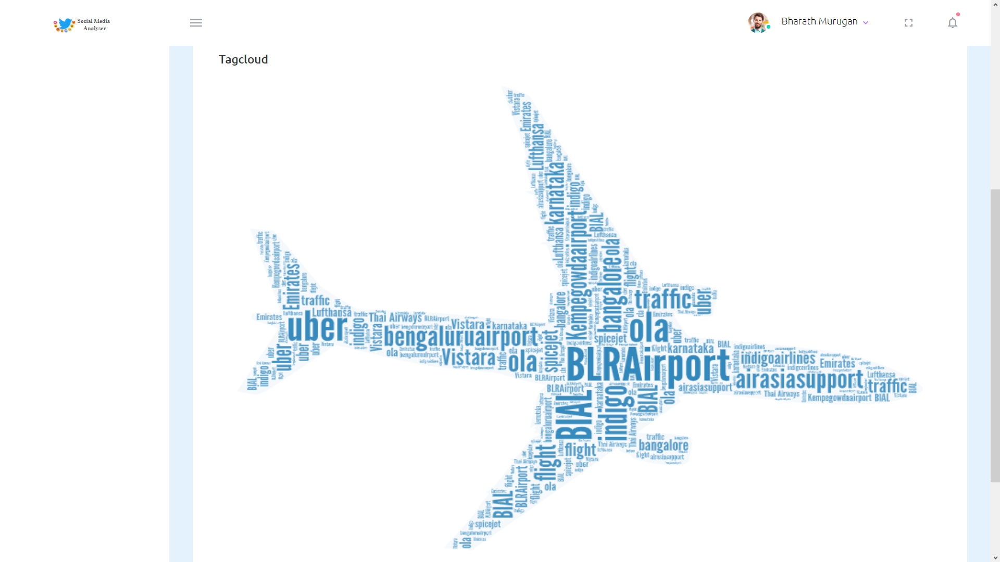

# Social Media Analytics
### The Future of Analytics in Social Media Platform 

Social media has an enormous amount of information.It is a general platform where the common people can give advice and feedback and keep up-to-date with the latest news.

Social Media Analyzer will scrap the posts of common people from three major social media platforms Twitter,Facebook and Instagram and analyse the data into 4 major aspects like.

          ● Sentiment Analysis - To determine the writer’s attitude.

          ● Emotion Analysis - To determine the emotions expressed by the people.

          ● Topic Modelling - To find the hidden semantic structures.

          ● Entity Analysis - To find the frequently used organisations and mention their pros and cons.

With a few clicks of a button, we’re able to see which tactics are working and which aren’t, allowing us to focus more of our efforts and resources on tactics that deliver actual value and work on improving upon those that aren’t.Using real-time social media analytics, we can identify issues before they reach a crisis level, and quickly share insights with other relevant teams.

__Screenshots__

